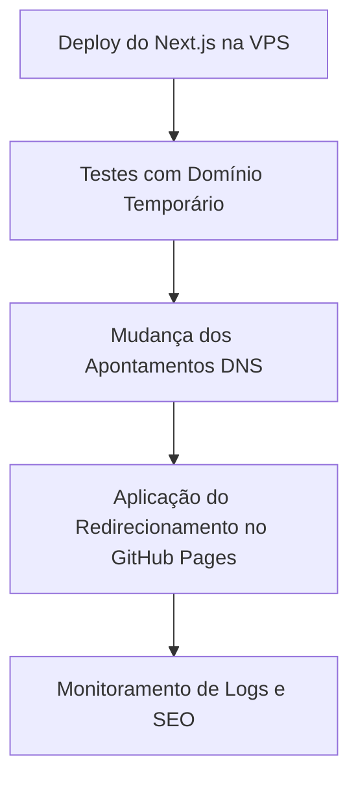

# Plano de Desativação (Sunset) do GitHub Pages

O portfólio legado de Alberto Mateus era hospedado no **GitHub Pages** como um site estático gerado via Vite. Com a migração para a arquitetura dinâmica **Next.js (App Router)** rodando em container VPS, a hospedagem estática nativa do GitHub Pages torna-se incompatível devido à necessidade de um servidor Node.js ativo (especialmente para SSR, rotas dinâmicas e o ecossistema do IGARIX).

Este documento descreve o plano de desativação controlada da hospedagem antiga e o redirecionamento correto de tráfego para a nova VPS.

---

## 1. Estado Atual e Desafio
* **Hospedagem Antiga**: GitHub Pages mapeado para o repositório `albertomateus9.github.io` servindo arquivos estáticos em `https://albertomateus9.github.io/`.
* **Nova Hospedagem**: VPS convencional ou Dokploy rodando a imagem Docker com suporte a Next.js standalone no domínio customizado `https://albertomateus.dev` (ou similar).
* **Desafio**: Evitar links quebrados para visitantes antigos ou motores de busca (SEO) que indexaram a URL legada do GitHub Pages.

---

## 2. Cronograma de Transição



### Fase 1: Homologação na VPS (Downtime Zero)
1. Concluir o deploy da aplicação Next.js em produção na VPS/Dokploy utilizando um domínio ou subdomínio de teste (ex: `vps.albertomateus.dev`).
2. Validar que todas as 11 rotas e os dados estão respondendo perfeitamente via HTTPS.

### Fase 2: Configuração de DNS e SSL
1. Alterar os apontamentos de DNS do seu domínio principal (`albertomateus.dev`):
   * Remover os IPs antigos do GitHub Pages (`185.199.108.153` etc.).
   * Adicionar um registro `A` apontando para o IP público da nova VPS.
   * Adicionar registro `CNAME` para o subdomínio `www` se necessário.
2. Aguardar a propagação de DNS e a emissão automática do SSL pelo Caddy/Traefik no Dokploy.

### Fase 3: Redirecionamento do GitHub Pages (O Sunset)
Como o GitHub Pages não suporta redirecionamentos do tipo HTTP 301 no nível do servidor (já que é estático), faremos um redirecionamento seguro via código (Client-side redirect).

1. Crie uma branch de arquivamento ou limpe a branch padrão que o GitHub Pages lê (normalmente `main` ou `gh-pages`).
2. Substitua o conteúdo da branch servida pelo GitHub Pages por um único arquivo `index.html` contendo a seguinte estrutura de redirecionamento:

```html
<!DOCTYPE html>
<html lang="pt-BR">
  <head>
    <meta charset="UTF-8" />
    <meta http-equiv="refresh" content="0; url=https://albertomateus.dev/" />
    <link rel="canonical" href="https://albertomateus.dev/" />
    <title>Redirecionando...</title>
    <script>
      window.location.replace("https://albertomateus.dev" + window.location.pathname + window.location.search);
    </script>
  </head>
  <body>
    <p>O Portfolio OS mudou para um novo endereço.</p>
    <p>Se você não for redirecionado automaticamente, clique aqui: <a href="https://albertomateus.dev/">albertomateus.dev</a>.</p>
  </body>
</html>
```

*Este script garante que qualquer subpasta ou query string legada (se houver) seja repassada para o novo domínio.*

---

## 3. Desativação Completa (Opcional - Futuro)
Após um período de 6 a 12 meses sob monitoramento:
1. Você poderá desativar completamente a funcionalidade do GitHub Pages nas configurações do repositório (`Settings > Pages > Build and deployment > Source: None`).
2. O repositório passará a servir estritamente como controle de versão para o código-fonte da aplicação rodando na VPS.
